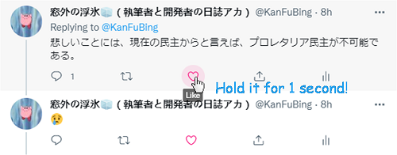

# Twitter Thread Liker

Sometimes we want to like all tweets of a good thread, but it's a bit of a hassle. Now this extension enables you to like all tweets of the thread tweeter with a simple one-second hold. (In fact it likes every tweet sended by the original Tweeter under the tweet.)

**Download as ZIP and import to Chrome!**

> How it works:
> 
> 1. Listen to URL change, and it fires on thread fully loaded.
> 2. Find all containers of tweets sended by the Tweeter but not other users. Characteristics: `[data-testid="tweet"]`, `href === tweeterName`.
> 3. Find all *Like* buttons of the filtered tweets. Container Characteristic: `[aria-label*="Like"][role="button"]`.
> 4. Add hold listener, click all filtered buttons if held for 1 second (precisely, 0.8s). Mark these special *Like* buttons and mount.
